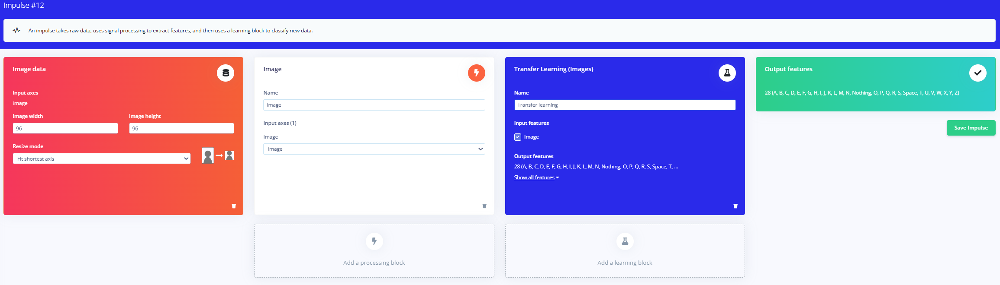
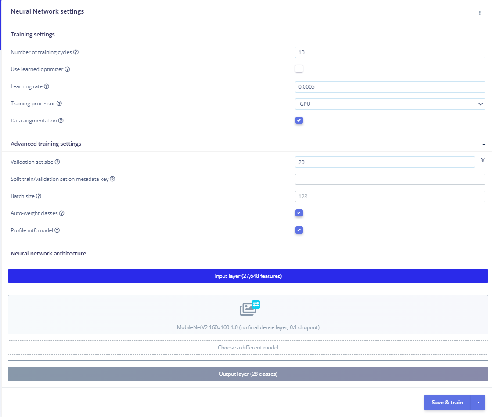

# Beginner Workflow Edge Impulse

I define the beginner developer workflow on Edge Impulse to be a developer who makes no/minimal changes to default Edge Impulse settings. 

Here are the steps for this beginner workflow to accomplish the ASL Classification task. 

## 1. Upload the training/testing images into Edge Impulse. 

## 2. Create the Impulse
Add in the image data and resize mode and modify the learning block however you chose. These are the settings I used:



## 3. Image
In the image section, save parameters and generate features. This should take less than 15 minutes. 

## 4. Tranfer Learning
Since this is the beginner workflow there are no code modifications to the neural network setting. Here are the final settings I used before I clicked **Save & Train**. 



## 5. Model testing / Deployment
Go to the Model Testing tab and click **Classify all** in order to test the data with your new Impulse. To deploy, select the Deployment tab and either select to "Launch in browser" or run on the Rubik Pi using:

``` bash
edge-impulse-linux-runner
```